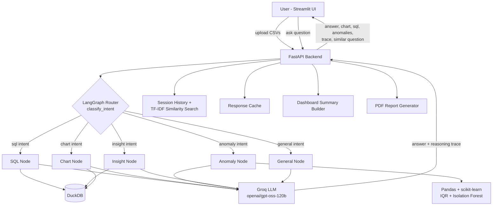

# AI Data Analyst

An AI-powered data analyst built for the Digital Back Office Ltd. AI Engineer Internship assignment. Upload one or more CSV files and ask questions about them in plain English — the app answers, generates charts, writes SQL, detects anomalies, and explains its reasoning at every step.

‼️**Demo video:** *(https://youtu.be/MfMCJeQgZtM)*

## Features

- **Natural language Q&A** over uploaded CSV data
- **Multi-file support** — upload several CSVs in one session and ask questions that span across them
- **Business insights & summaries** generated by an LLM
- **Chart generation** (bar, line, pie, scatter, etc.) via Plotly
- **SQL / Pandas generation** — shows the exact query used to answer a question
- **Anomaly detection** with plain-language explanations, using IQR (per-category) + Isolation Forest
- **Agent reasoning trace** — every answer comes with an expandable "how I got this" trace
- **Conversation memory** — session-scoped history maintained throughout
- **Dashboard tab** — auto-generated summary (total revenue, top breakdowns, anomaly count, data quality warnings)
- **Proactive similar-question detection** — if you ask something close to a question you already asked in this session, the app surfaces the earlier Q&A alongside the new answer (TF-IDF + cosine similarity)
- **PDF export** of the full session
- **Response caching** per session/question
- **Dockerized** — one command brings up both services

## Architecture



**Flow:** the user uploads CSVs, which are validated and loaded into a per-session DuckDB instance. Each question is classified by a LangGraph router into one of five intents (`sql`, `chart`, `anomaly`, `insight`, `general`), and routed to the matching node, which either queries DuckDB directly or runs Pandas/scikit-learn analysis before asking the Groq LLM to generate the final natural-language answer and reasoning trace. Every question is also checked against the session's own history via TF-IDF similarity before being answered, so a repeated or near-duplicate question surfaces the earlier answer alongside the new one.

## Tech Stack

| Layer | Technology |
|---|---|
| Backend | FastAPI |
| Agent orchestration | LangGraph |
| Data engine | DuckDB (SQL) + Pandas |
| LLM | Groq API (`openai/gpt-oss-120b`) |
| Charts | Plotly |
| Anomaly detection | IQR (per-category) + Isolation Forest (scikit-learn) |
| Semantic search | TF-IDF + cosine similarity (scikit-learn) |
| Frontend | Streamlit |
| Containerization | Docker + docker-compose |
| Testing | pytest |

## Setup

### Prerequisites

- Python 3.12
- A free [Groq API key](https://console.groq.com)
- Docker & Docker Desktop (for the containerized route)

### Option A — Docker (recommended)

```bash
git clone <your-repo-url>
cd ai-data-analyst-new

# add your Groq API key
cp backend/.env.example backend/.env
# edit backend/.env and set GROQ_API_KEY

docker-compose up --build
```

- Backend: http://localhost:8000
- Frontend: http://localhost:8501

Health check: `curl http://localhost:8000/api/health`

### Option B — Manual (two virtualenvs)

**Backend:**
```bash
cd backend
python3.12 -m venv proj
source proj/bin/activate
pip install -r requirements.txt

cp .env.example .env   # set GROQ_API_KEY
uvicorn app.main:app --reload
```

**Frontend** (in a separate terminal):
```bash
cd frontend
python3.12 -m venv proj
source proj/bin/activate
pip install -r requirements.txt

streamlit run app.py
```

> On Apple Silicon, if you hit a `pandas`/`numpy` circular-import error or a silent crash during anomaly detection, it's almost always a `numpy`/`pandas` version mismatch or an OpenBLAS multiprocessing conflict. Pin `numpy<2.2` with `pandas==2.2.3`, and keep `IsolationForest(..., n_jobs=1)`.

### Sample data

`sample_data/sales_data.csv` and `sample_data/regional_targets.csv` are included — upload both together to try multi-file questions like *"Which regions are underperforming against their revenue targets?"*

## Example Questions

- Which region generated the highest revenue?
- Show monthly sales trends.
- Which products are underperforming?
- What are the top 5 customers?
- Generate SQL for total revenue by category.
- Detect anomalies in the dataset.
- Which regions are underperforming against their revenue targets? *(multi-file)*

## Running Tests

```bash
cd backend
source proj/bin/activate
pytest tests/
```

Covers anomaly detection, chart generation, data manager/session handling, and SQL-generation safety (guarding against unsafe/destructive SQL).

## Evaluation

`eval/run_eval.py` runs a small evaluation harness against the LangGraph router's intent classification, to catch regressions like questions being misrouted between `sql`, `chart`, `insight`, and `anomaly`.

```bash
cd backend
python -m eval.run_eval
```

## Assumptions & Implementation Notes

- **Anomaly detection is grouped per-category, not global** — during testing, the dataset contained a **₹4500 Premium Laptop Stand**, which was significantly more expensive than the other products in the `Electronics` category and was correctly identified as an outlier. Using a single global IQR bound across all products produced misleading comparisons between unrelated categories and increased false positives. Bounds are therefore computed per `category` group instead, so each product is compared only against similar items within its own category.
- **Derived and identifier columns are excluded from anomaly features** — `revenue` (= `quantity × unit_price`) is dropped from the feature set since it's mathematically derived from other flagged columns, and any column containing `id` (e.g. `order_id`) is excluded since identifiers carry no statistical meaning and previously distorted which row got flagged.
- **A minimum severity floor (0.3)** is applied so that rows barely outside the IQR bound aren't flagged — only genuinely extreme deviations are surfaced.
- **`IsolationForest` runs with `n_jobs=1`** as a defensive fix for a joblib/OpenBLAS multiprocessing segfault observed on Apple Silicon.
- **Similar-question detection is session-scoped and in-memory** — it compares the incoming question against the current session's own conversation history only (not across sessions/users), using TF-IDF + cosine similarity with a 0.65 similarity threshold to avoid noisy false positives.
- **The SQL generation prompt includes sample distinct values** for text columns (not just column names/types) — this was necessary because the LLM would otherwise guess filter values with the wrong case (e.g. `'notebook'` instead of the actual `'Notebook Set'`), returning empty results.
- **Router misclassification safety net:** if a "show trend" style question is misrouted to the insight node instead of chart, the insight node still builds a full date-based aggregation rather than only summarizing the first 10 rows, so the answer stays correct even if routing is imperfect.
- **Session data is in-memory / local disk (`storage/`)** and not persisted to an external database — sessions do not survive an app restart. This was a deliberate scope decision for a single-session assignment demo rather than a production multi-user deployment.
- **No authentication** is implemented — out of scope for this assignment; each browser session gets its own isolated `session_id`.

## Deliverables Checklist

- [x] Source code (FastAPI + LangGraph backend, Streamlit frontend)
- [x] README with setup instructions
- [x] Architecture diagram (above)
- [x] Screenshots / demo video (see `docs/` or linked below)
- [x] Docker support
- [x] Sample datasets (`sample_data/`)


